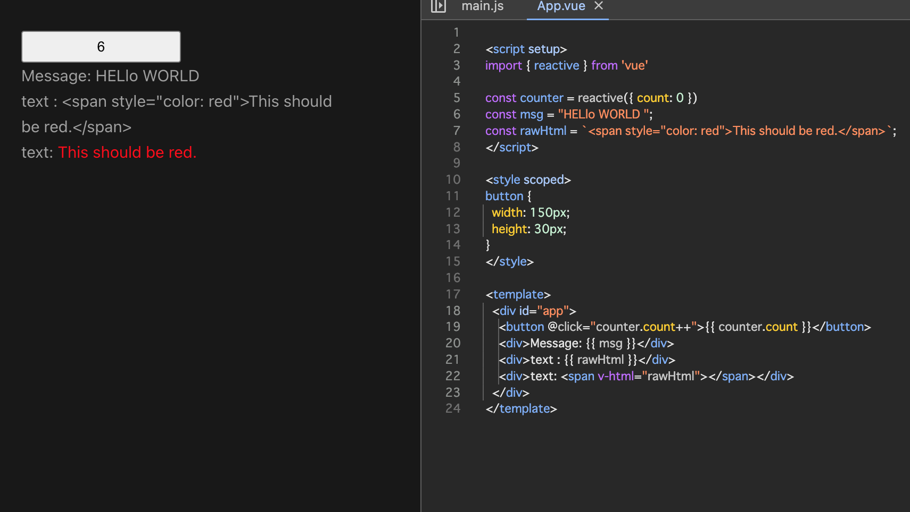

# テンプレート構文
https://ja.vuejs.org/guide/essentials/template-syntax.html

VueはHTMLベースのテンプレート構文を使用します。

- コンポーネントのインスタンスのデータ
- レンダリングされるDOMを宣言的にバインド
- リアクティビティー機構の組み合わせ
    - 再レンダリングを最小限のコンポーネントで見つけ出す

などが可能

内部ではテンプレートをコンパイルし、高度に最適化されたJavaScriptのコードにします。

## テキスト展開
データバインディングで「マスタッシュ構文」(二重中括弧)によるテキスト展開が可能

```html
<!-- template -->
<span>Message : {{ msg }}</span>
```
マスタッシュの中身は、対応するコンポーネントのインスタンスが持つ`msg`というプロパティの値に置き換えられます。  
`msg`プロパティが変更されるたびマスタッシュの中身も更新されます。

## 生のHTML
マスタッシュの中では、データがHTMLではなくプレーンテキストとして解釈されます。本来のHTMLを出力したい場合は、次のように`v-html`ディレクティブを用いる必要があります。



```js
<script setup>
const rawHtml = `<span style="color: red">This should be red.</span>`;
</script>
```

```html
<p>Using text interpolation: {{ rawHtml }}</p>
<p>Using v-html directive: <span v-thml="rawHtml"></span></p>
```

この例にある`v-html`という属性は「 __ディレクティブ__ 」と呼ばれるものです。ディレクティブは`v-`というprefixを持ち、Vueによって提供される特別な属性であることを示します。ディレクティブはレンダリングされるDOMに特別なリアクティブな振る舞いを割り当てます。

この例では、「現在アクティブなインスタンスが持つ`rawHtml`というプロパティをこの要素のinner HTMLに適用して最新に保つ」ということが書かれています。


`span`の中身は`rawHtml`プロパティが持つ値に置き換えられ、プレーンなHTMLとして解釈されます。(データバインディングは無視されます。)

`v-html`はテンプレートの断片を組み立てるのには利用できないことに注意してください。これは、Vueが文字列ベースのテンプレートエンジンではないためです。その代わり、UIの再利用や組み立ての基本単位として推奨されているのが「コンポーネント」です。


## 属性バインディング
HTML属性の中では __マスタッシュ__ 構文が使えません。代わりに以下の`v-bind`ディレクティブを使用します。

```html
<div v-bind:id="dynamicId"></div>
```

この`v-bind`ディレクティブは要素の`id`という属性を、コンポーネントが持つ`dynamicId`というプロパティと同期させるようVueに指示しています。バインドされた値が`null`または`undefined`の場合、その属性はレンダリングされる要素から除外されます。

### 省略記法
`v-bind`は使用頻度が非常に高いため、省略記法があります
```html
<div :id="dynamicId"></div>
```

`:`で始まる属性は、普通のHTMLの記法とは少し異なるように見えますが、実際には属性名として有効な文字です。Vueをサポートするすべてのブラウザは正しく解析できます。


## ブーリアン属性
要素に含まれているかどうかによって真偽の値を表す属性  
`disabled`は最も一般的に用いられるブーリアン属性の１つです。
```html
<button :disabled="isButtonDisabled">Button</button>
```

`<button disabled="">`との一貫性を保つため、値が空の文字列である場合にも含まれます。


## 複数の属性を動的にバインドさせる
`v-bind`を引数なしで用いると、これらの複数の属性を１つの要素にバインドすることが可能

```js
const objectOfAttrs = {
    id: 'container',
    class: 'wrapper',
    style: 'background-color:green',
}
```
```html
<div v-bind="objectOfAttrs"></div>
```


## JavaScriptの式
Vueはあらゆるデータバインディングにおいて、以下のようにJavaScript式のフルパワーを活用することができます
Vueのテンプレートでは、以下の場所でJavaScriptの式を使用することができます

- テキスト展開の内部 (マスタッシュ構文内)
- 任意のVueディレクティブ (v-で始まる特殊な属性)の属性値の中身
```html
{{ number + 1 }}
{{ ok ? 'YES' : 'NO' }}
{{ message.split('').reverse().join('') }}

<div :id="`list-${id}`"></div>
```

## 式に限られる
それぞれのバインディングには、単一の式しか含めることができません。式とは、ある値に対して評価されるコードの一部分です。簡単なチェックは、`return`の後に使えるかどうかです。  
そのため、以下はうまく動作しません
```html
<!-- これは文であり、式ではありません -->
{{ var a = 1 }}

<!-- フロー制御も動作しません。かわりに三項演算子を使用してください -->
{{ if (ok) { return message } }}
```

## 関数呼び出し
コンポーネントから公開されているメソッドであれば、バインディングの式の内部で呼び出せる
```html
<time :title="toTitleDate(date)" :datetime="date">
    {{ formatDate(date) }}
</time>
```

TIP バインディングの式の内部で呼び出される関数は、コンポーネントが更新されるたびに呼び出されます。そのため、データの変更や非同期処理をトリガーするような副作用を持たせてはいけません。

## グローバルへのアクセスの制限
テンプレートで用いる式はサンドボックス内で実行され、限定的なグローバルのリストにのみアクセスできます。このリストには、`Math`や`Date`などのよく使われる組み込みでグローバルが含まれています。

ユーザーが`window`に付与したプロパティなど、このリストに明示的に含まれていないグローバルには、 __テンプレート内の式からアクセスすることができません。__ ただし、`app.config.globalProperties`に追加することにより、Vueのあらゆる式で利用できるグローバルを明示的に定義することができます。


## ディレクティブ
`v-`というprefixを持つ特別な属性です。Vueでは、`v-html`、`v-bind`をはじめ、数々の組み込みディレクティブが用意されています。

ディレクティブの属性値は、JavaScriptの単一の式であることが期待されます(ただし`v-for`、`v-on`、`v-slot`は例外であり、後ほどそれぞれのセクションで説明します)。  
ディレクティブの役割は、 __式が示す値が変化したとき、リアクティブに更新をDOMに適用する__ ことです。

例
```html
<p v-if="seen">Now you see me</p>
```
`v-if`というディレクティブを用いて、式`seen`が示す値の真偽に基づいて要素`<p>`を削除したり挿入したりします。


## 引数
一部のディレクティブは引数を取ることができます。引数は、ディレクティブ名の後にコロンで示します。`v-bind`ディレクティブを使ってHTML属性の１つをリアクティブに更新する例です

```html
<a v-bind:href="url">...</a>
<!-- 省略記法 -->
<a :href="url">...</a>
```
v-bindの引数`href`。`href`という属性を`url`という式の値にバインドするという指示が伝えられます。

別の例として、DOMイベントを購読する`v-on`ディレクティブを紹介します

```html
<a v-on:click="doSomething"> ... </a>

<!-- 省略記法 -->
<a @click="doSomething"> ... </a>
```
この例では、引数は購読するイベント名の`click`です。`v-on`には対応する省略形があり、`@`という文字です。イベントのハンドリングについても、後ほど詳しく説明します。

## 動的引数
ディレクティブの引数を指す部分では、以下のように角括弧で囲んだJavaScriptの式を用いることもできます。

この例では、`attributeName`がJavaScriptの式として動的に評価され、そこで評価された値が最終的な引数を渡す値として使用されます。
コンポーネントのインスタンスが`attributeName`というデータプロパティを持ち、その値が`"href"`のとき、このバインディングは`v-bind:href`と同等になります。
```html
<a v-bind:[attributeName]="url">...</a>
<!-- 省略 -->
<a :[attributeName]="url">...</a>
```

同じように、動的引数を用いてハンドラーを動的なイベント名にバインドすることもできます
```html
<a v-on:[eventName]="doSomething"> ... </a>
<!-- 省略 -->
<a @[eventName]="doSomething"> ... </a>
```

## 動的引数の値に関する制約
動的引数は、評価結果が`null`または文字列のいずれかになることが期待されます。`null`は特別な値で、バインディングを削除することを明示的に表します。それ以外の非文字列の値を指定すると、警告が発生します。

## 動的引数の構文上の制約
動的引数の式には、構文上の制約がいくつかあります。これはスペースや引用符など特定の文字がHTMLの属性名の中では無効となるためです。例えば、次のようなものは無効となります。

```html
<a :['foo' + bar]="value"> ... </a>
```
複雑な動的引数を渡す必要がある場合は、後ほど取り上げる算出プロパティを使用するとよいでしょう。

また、 __HTMLファイルに直接記述するDOM内テンプレート__ を使用する場合、ブラウザでは属性名が小文字であることが求められるため、以下のように大文字のキー名を使用することは避ける必要があります
```html
<a :[someAttr]="value"> ... </a>
```
このコードは`:[someattr]`に変換されます。もしコンポーネントに`someattr`ではなく`someAttr`というプロパティしかなければ、このコードは動作しません。単一ファイルコンポーネント内のテンプレートは、この制約の対象外です。

## 修飾子
ドットで示される渡航別なprefixで、ディレクティブをなんらかの特別な方法でバインドすることを表します。例えば、以下に示す`.prevent`という修飾子は、イベントがトリガーされたときに`event.preventDefault()`を呼び出すことを`v-on`ディレクティブに伝えます
```html
<form @submit.prevent="onSubmit">...</form>
```


## event.preventDefault()
- eventのDefaultの動作をpreventする(妨げる)

例
- フォームが持つデフォルトの動作はフォームの内容を指定したURLへ送信するという動作
- event.prevenDefault()を呼び出すことで、このデフォルトの動作をキャンセルする

```js
formElement.addEventListener("submit", (event) => {
    // submitイベントの本来の動作を止める
    event.preventDefault();
    console.log(`入力欄の値: ${inputElement.value}`);
});
```
